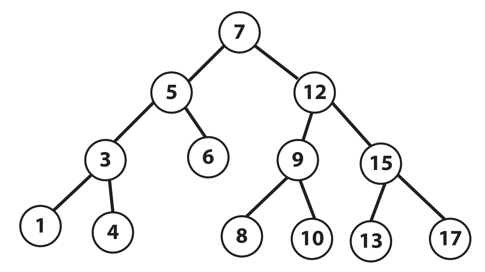

# Advanced Programming Exam
### Author: Rodolfo Tolloi, Giulia Bernardi 
#
## Brief Description:
In this readme file, we describe briefly the structure of the repository, its files, how to compile them and run them.

### - main.cpp
[link to file](./main.cpp)\
This file contains a series of tests to check that the binary search tree class (`bst`) works properly. The following tree was implemented as an example.\
\

### - benchmark-bst.cpp
[link to file](./benchmark-bst.cpp)\
This file contains a simple benchmark of the find function of the `bst` class, against the equivalent function of `std::map`.

### - makefile
[link to file](./Makefile)\
This file is used to compile in the right way both benchmark-bst.cpp and main.cpp. If run with "make documentation", it will generate the Doxygen documentation.

## Folder: Include
### - node.hpp
[link to file](./include/node.hpp)\
This file creates a struct `node` with some base functions and operators.
### - iterator.hpp
[link to file](./include/iterator.hpp)\
This file creates a struct `iterator` with some base functions and operators. In particular the pre-increment operator `++`.
### - bst.hpp
[link to file](./include/bst.hpp)\
This file creates a class `bst` with some functions and operators.

## Folder: Doxygen
### - doxy.in
[link to file](./Doxygen/doxy.in)\
This is the Doxygen configuration file.

#
## Compilation:
To compile in the correct way the files, the user just needs to run the command "make" in the terminal. To obtain also the Doxygen documentation, the user must use "make documentation".

#
## Execution:
To run the *main* program, the user must use the command "./main.x". Similarly for *benchmark-bst*, the command is "./benchmark-bst". This program will ask the user for the size of the random tree on which the benchmark will be performed.

#
## Report:
Inside "report.pdf" [link to file](./Report.pdf) is contained a short report about the code.